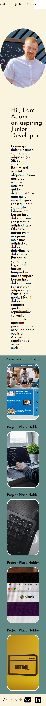

# My-Portfolio

## introduction
 In this bootcamp challenge,we were tasked with creating our own portfolio that we can use throughout the bootcamp and into the real world.

 I used concepts from the last 2 weeks of lessons, including semantic html, CSS Flexbox , CSS Grid and media queries. 

## Technologies
Project is created with HTML AND CSS

## Image of web page

## Image of web page below 800px

## Link to live site

https://gpsnm.github.io/My-Portfolio/
